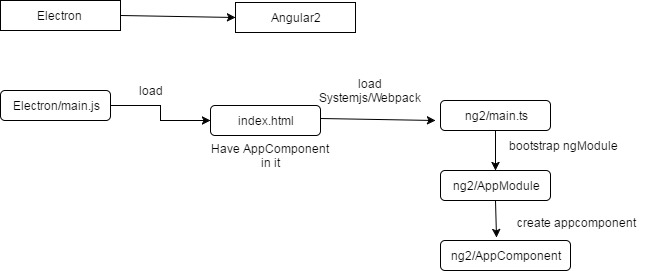

# Hello World from "Electron App + Angular 2"

To get started, clone the repo to your target directory. Few commands have been provided as scripts in `package.json`.

```bash
npm install

# To build only
npm run build

# To watch for changes
npm run watch

# Start the Electron app
npm run electron
```
* telling Webpack to bundle up the Angular 2 scripts and serve them from a single angular2.js bundle that will be in the build directory. The scripts for our app will be served from a separate bundle called app.js.
* need some TypeScript configuration in a tsconfig.json file at the project root.
* inside the app subdirectory, we need to provide a package.json file that will simply tell Electron which script to use for bootstrapping. This will be the main.js file, and in it, we will tell Electron how to open and close our app.
* main.js script is really just some boilerplate that Electron needs to fire up. create a browser window with specific dimensions and then load an index.html file from the app directory.
* command "npm run watch" was set up in our package.json file in the project root, and it runs webpack with some options. One of these options is to watch for changes, so we can now edit our app.ts file and everything will automatically get bundled again.
* It's worth noting that a lot of this was just to set up Angular 2 and wasn't because of Electron specifically. 
* If everything is wired up properly, we should now see our "Hello World" message.



